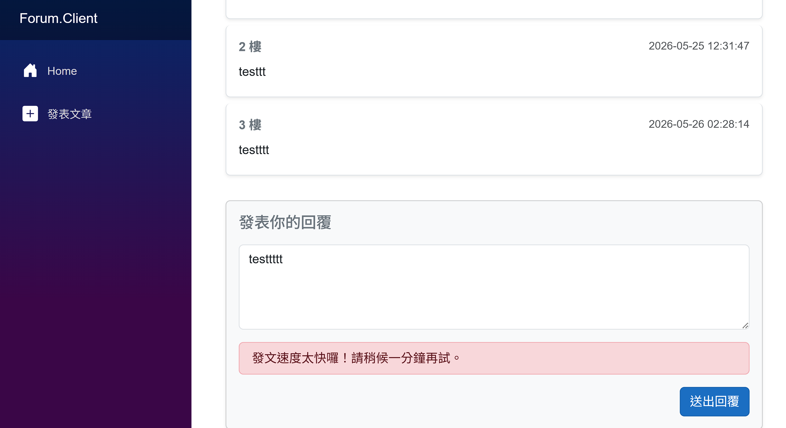

# Forum
基於 .NET 10 打造的論壇。後端採用 ASP.NET Core Web API 搭配 Entity Framework Core，前端則使用 Blazor WebAssembly，並透過 Redis 實現 cooldown。

---

### 後端
* **框架**：.NET 10.0 (ASP.NET Core Web API)
* **資料庫 ORM**：Entity Framework Core 10
* **實體資料庫**：Microsoft SQL Server
* **快取** : Redis

### 前端
* **框架**：Blazor WebAssembly (WASM) .NET 10
* **樣式庫**：Bootstrap 5

## 主畫面

### 功能
* 發布文章

* 回文

* 發文回文冷卻

