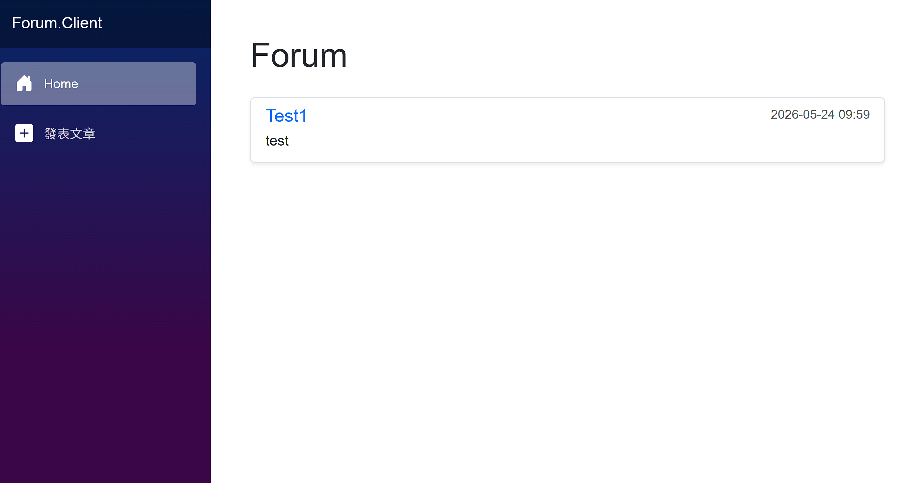
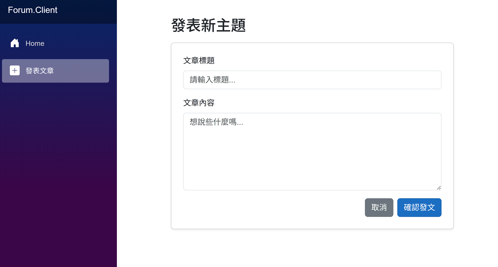
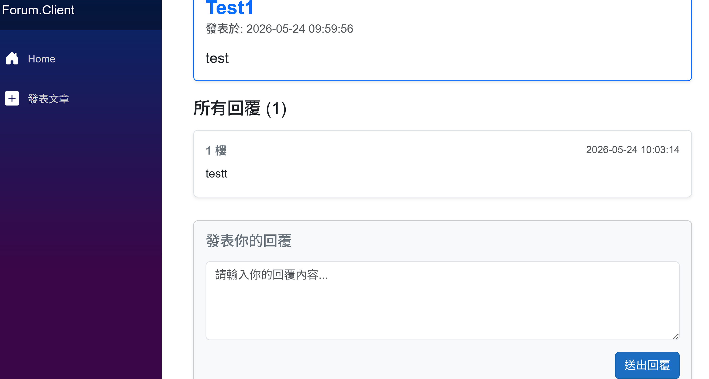

# Forum

### 後端
* **框架**：.NET 10.0 (ASP.NET Core Web API)
* **資料庫 ORM**：Entity Framework Core 10
* **實體資料庫**：Microsoft SQL Server

### 前端
* **框架**：Blazor WebAssembly (WASM) .NET 10
* **樣式庫**：Bootstrap 5

## 主畫面

### 功能
* 發布文章

* 回文

## 未來更新
* 預計加入 Redis TTL 處理 cooldown
* 優化查詢